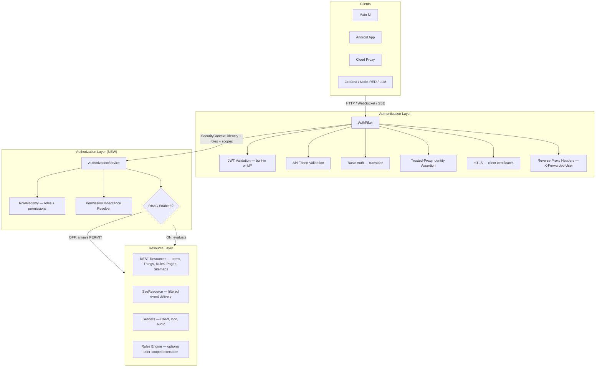
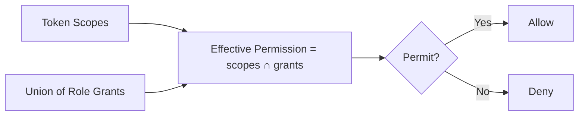
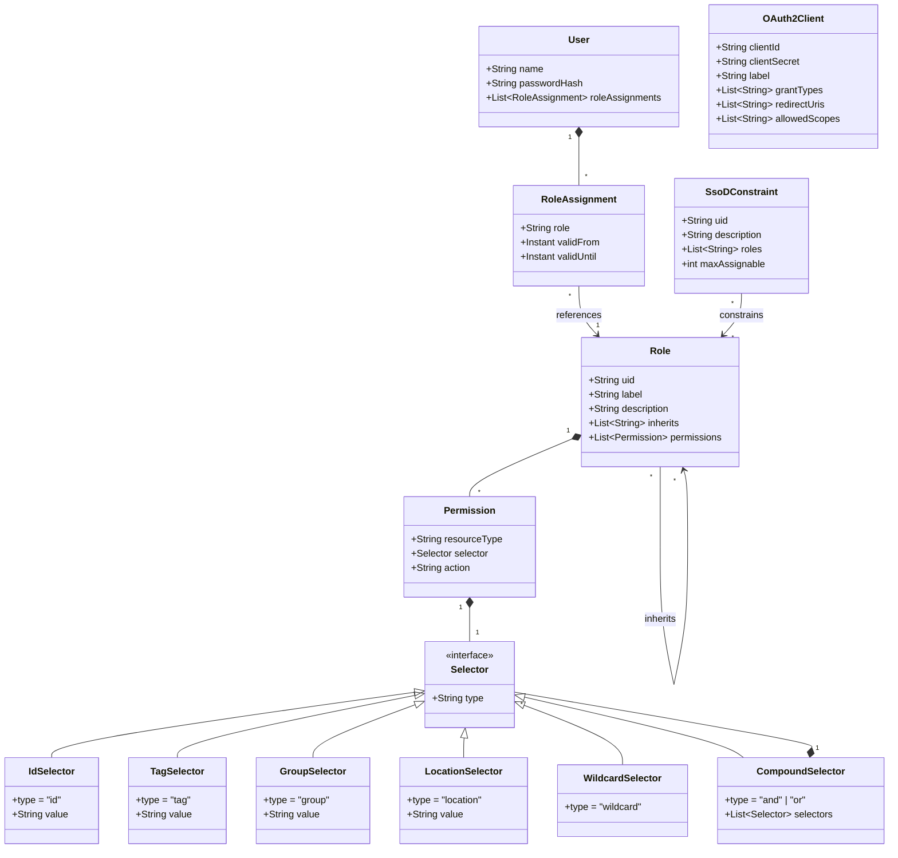
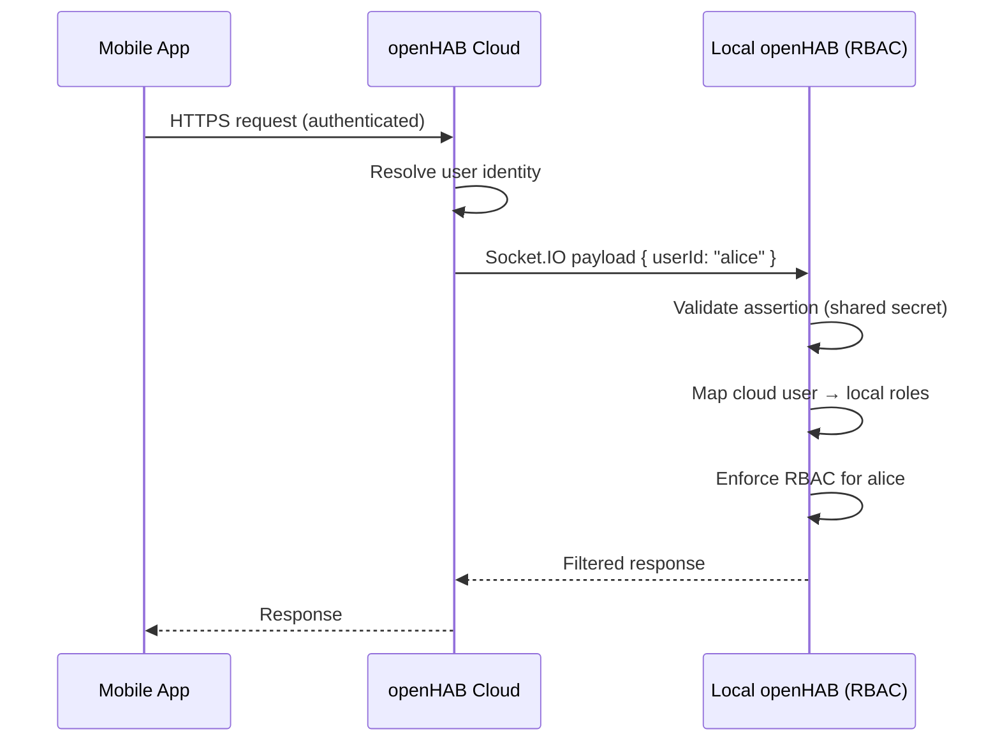

# RBAC for openHAB — High-Level Design

**Source of truth:** `requirements.md`

---

## 1. Architecture Overview





---

## 2. Data Structures



### Permission

A permission is a tuple of resource type, selector, and action.

```json
{
  "resourceType": "item",
  "selector": { "type": "location", "value": "AlicesRoom" },
  "action": "command"
}
```

**Resource types:** `item`, `thing`, `action`, `page`, `rule`, `sitemap`, `transformation`

**Actions (hierarchical):** `read` → `command` → `edit` → `admin`
- `admin` implies all below it
- Resources where `command` doesn't apply (e.g., sitemaps): `read` → `edit` → `admin`

**Selector types:**

| Type | Matches | Example |
|------|---------|---------|
| `id` | Single resource by ID | `{ "type": "id", "value": "LivingRoom_Light" }` |
| `tag` | All resources with a tag | `{ "type": "tag", "value": "GuestAccessible" }` |
| `group` | All members of a group (recursive) | `{ "type": "group", "value": "gLivingRoom" }` |
| `location` | All items in a semantic Location | `{ "type": "location", "value": "AlicesRoom" }` |
| `wildcard` | All resources of that type | `{ "type": "wildcard" }` |

**Compound selectors (AND/OR):**

Selectors can be combined for complex matching:

```json
{
  "resourceType": "item",
  "selector": {
    "type": "and",
    "selectors": [
      { "type": "location", "value": "GroundFloor" },
      { "type": "tag", "value": "Lighting" }
    ]
  },
  "action": "command"
}
```

```json
{
  "resourceType": "item",
  "selector": {
    "type": "or",
    "selectors": [
      { "type": "location", "value": "AlicesRoom" },
      { "type": "location", "value": "SharedAreas" }
    ]
  },
  "action": "command"
}
```

`and` = resource must match ALL selectors. `or` = resource must match ANY selector. Nesting is allowed (AND inside OR, etc.) but discouraged beyond one level for readability.

### Role

A named set of permissions. Supports inheritance from other roles. Stored in JSON DB.

```json
{
  "uid": "child-alice",
  "label": "Alice's Role",
  "description": "Access to Alice's room and shared areas",
  "inherits": ["shared-areas"],
  "permissions": [
    {
      "resourceType": "item",
      "selector": { "type": "location", "value": "AlicesRoom" },
      "action": "command"
    }
  ]
}
```

```json
{
  "uid": "shared-areas",
  "label": "Shared Areas",
  "description": "Common spaces everyone can use",
  "inherits": [],
  "permissions": [
    {
      "resourceType": "item",
      "selector": {
        "type": "or",
        "selectors": [
          { "type": "location", "value": "Kitchen" },
          { "type": "location", "value": "LivingRoom" },
          { "type": "location", "value": "Bathroom" }
        ]
      },
      "action": "command"
    }
  ]
}
```

**Role inheritance:** A role's effective permissions = its own permissions ∪ permissions of all roles in `inherits` (resolved recursively, cycles detected and rejected at save time).

**Built-in roles:**
- `administrator` — full access, non-deletable, non-restrictable, `inherits` ignored
- `user` — configurable default permissions, non-deletable

### Role Assignment (on User)

```json
{
  "name": "alice",
  "passwordHash": "...",
  "roleAssignments": [
    {
      "role": "child-alice",
      "validFrom": null,
      "validUntil": null
    },
    {
      "role": "guest-wifi",
      "validFrom": "2025-06-01T00:00:00Z",
      "validUntil": "2025-06-07T00:00:00Z"
    }
  ]
}
```

- `validFrom` / `validUntil` — nullable. When null, the assignment is perpetual.
- Outside the validity window, the assignment is treated as non-existent.
- Expired assignments are retained (for audit) but marked inactive.

### OAuth2 Client

```json
{
  "clientId": "openhab-ui",
  "clientSecret": null,
  "label": "Main UI",
  "grantTypes": ["authorization_code", "refresh_token"],
  "redirectUris": ["https://openhab.local/"],
  "allowedScopes": ["items:read", "items:command", "things:read", "rules:read", "pages:read"]
}
```

### Separation of Duties Constraint

```json
{
  "uid": "ssod-finance-audit",
  "description": "Finance and audit roles are mutually exclusive",
  "roles": ["finance-manager", "auditor"],
  "maxAssignable": 1
}
```

`maxAssignable` = how many of the listed roles one user can hold simultaneously. Typically 1 (can only have one of them).

---

## 3. Effective Permission Calculation

```
effective(user, resource, action) =
    rbacEnabled
    AND action ∈ tokenScopes
    AND action ∈ resolvedPermissions(user)

resolvedPermissions(user) =
    union(effectivePermissions(role) for role in activeAssignments(user))

effectivePermissions(role) =
    role.permissions ∪ union(effectivePermissions(r) for r in role.inherits)

activeAssignments(user) =
    [a.role for a in user.roleAssignments where a.validFrom <= now <= a.validUntil]
```

A permission matches a resource if its selector matches (accounting for AND/OR logic) OR if the resource inherits a match via group membership / semantic model / Thing linkage.

When RBAC is disabled: all checks return PERMIT (today's behavior).

---

## 3. Key Components

### Reusing the merged voice permission primitive (#5626)

florian-h05's #5626 (merged to `main`, 2026-06-08) already provides an item-permission model — `ItemPermission` (`NO_ACCESS < READ_ONLY < READ_WRITE`, ordinal ordering is the priority), an `ItemPermissionResolver` interface, and a metadata-driven impl with a change-invalidated cache and an access-change listener — currently under `org.openhab.core.voice.security` / `...voice.internal.security`. The impl reads its policy from item `Metadata` (namespace `voiceSystem`, property `permission`) via `MetadataRegistry`, caches per-item results, invalidates on item- and metadata-registry changes, and exposes `addItemAccessChangeListener(Runnable)`.

Rather than introduce a parallel `Permission`/`Action` model, the foundation phase **generalizes this primitive out of the voice bundle into core auth**: move the interface + enum to `org.openhab.core.auth`, generalize the metadata namespace (`voiceSystem` → an `acl`/`auth` namespace), keep the cache + registry-change invalidation, and have the voice bundle consume the generalized resolver. `READ_WRITE`/`READ_ONLY`/`NO_ACCESS` map onto the `read → command → edit → admin` hierarchy (voice never needed `command`/`edit`/`admin`, so those are additive, not a conflict). Net effect: the item read/command evaluator (PR 1.1) and the event-stream filters (PR 1.3) build on merged, tested code and inherit its cache and its change-listener — the exact machinery §7 needs to refresh a subscriber's filter on permission change.

### AuthorizationService (new)

Central interface — all authorization decisions flow through here. REST resources, SSE, servlets, and the rule engine call this service. They never implement policy logic themselves (NFR-5).

**Interface (conceptual):**

```java
public interface AuthorizationService {
    boolean isPermitted(Authentication auth, String resourceType, String resourceId, String action);
    <T> Collection<T> filterPermitted(Authentication auth, String resourceType, Collection<T> resources, String action, Function<T, String> idExtractor);
    EffectivePermissions getEffectivePermissions(Authentication auth, String resourceType, String resourceId);
    boolean isEnabled();
}
```

**Caching:** Permission evaluations cached per user (invalidated on role/permission change events). Target: <5ms per check (NFR-1). Must handle 5000+ items with 10+ custom roles without degradation (NFR-2). For scale, the filter uses precomputed allowed-resource sets rather than per-event authorization calls.

### RoleRegistry (new)

A standard openHAB `Registry<Role, String>` backed by JSON DB. Manages custom roles and their permission sets. Built-in `administrator` and `user` roles are non-deletable providers.

### Permission Inheritance Resolver (new)

Resolves inherited permissions by walking:
1. Group membership chains (group Item → member Items) — works with all group Items, both semantic and plain groups
2. Semantic model (Location → Equipment → Points)
3. Thing → linked Items
4. Thing → Thing Actions (Thing Action permissions inherit from parent Thing by default, overridable individually)

Explicit grants on a resource stop inheritance traversal for that resource.

### Global Toggle

A PID-based configuration (`org.openhab.rbac`):
- `enabled` (default: `false`) — master switch
- `defaultRole` — role auto-assigned to new users (default: `user`)
- `guestRole` — role applied to unauthenticated requests (default: `guest` with deny-all). Replaces the current boolean `implicitUserRole`.

When `enabled = false`, `AuthorizationService.isPermitted()` always returns `true`.

**Built-in `guest` role:** A non-deletable role with empty permissions by default (deny-all). Admins can grant specific read/command permissions to it (e.g., allow unauthenticated users to view a welcome page). When RBAC is off, `implicitUserRole` continues to work as today.

---

## 4. OAuth2 AS Design

### Token Format (RFC 9068)

```json
{
  "typ": "at+jwt",
  "alg": "RS256",
  "kid": "openhab-signing-key-1"
}
{
  "iss": "https://<openhab-host>/",
  "sub": "alice",
  "aud": "openhab",
  "client_id": "openhab-ui",
  "scope": "items:read items:command rules:read",
  "role": ["parent", "child-alice"],
  "exp": 1700000000,
  "iat": 1699996400,
  "jti": "unique-token-id"
}
```

### Endpoints

| Endpoint | Purpose |
|----------|---------|
| `POST /oauth2/token` | Token issuance (AuthCode, Client Credentials, Refresh) |
| `GET /oauth2/authorize` | Authorization Code flow |
| `GET /oauth2/jwks` | Public signing keys |
| `POST /oauth2/introspect` | Token introspection (RFC 7662) |
| `POST /oauth2/revoke` | Token revocation (RFC 7009) |
| `GET /.well-known/openid-configuration` | OIDC Discovery |
| `GET /oauth2/clients` | Client management (admin) |

### Scope-Permission Relationship

OAuth2 scopes are coarse-grained gates: `items:read`, `items:command`, `things:admin`, etc. Fine-grained RBAC permissions operate within the scope boundary. Effective access = scope ∩ role permissions.

---

## 5. External IdP Mode

When configured, openHAB becomes a pure Resource Server:
- Validates tokens against the IdP's JWKS endpoint
- Maps claims (configurable path) to openHAB roles
- Disables built-in login/token endpoints
- UI redirects to IdP for authentication

**Supported external auth backends:**

| Backend | Mode | Description |
|---------|------|-------------|
| OAuth2/OIDC (Keycloak, Authentik, Azure AD) | Resource Server | Validates JWT against IdP's JWKS, maps claims to roles |
| LDAP/LDAPS (Active Directory, OpenLDAP, LLDAP) | Auth backend replacement | Authenticates users against LDAP directory, maps LDAP groups to openHAB roles. No frontend changes needed — only the credential validation backend changes. |
| Reverse proxy + oauth2-proxy | Trusted headers | Accepts identity assertions via standard headers (`X-Forwarded-User`, `X-Auth-Request-Email`, client certificate headers like `x-wso2-mtls-cert`). SSO works regardless of whether internal or external auth is used. |

Configuration (PID `org.openhab.auth.external`):
- `issuer` — IdP issuer URL
- `clientId` — openHAB's client ID at the IdP
- `roleClaimPath` — JSON path to roles in the access token (e.g., `realm_access.roles`)
- `roleMappings` — IdP role → openHAB role mappings

LDAP configuration (PID `org.openhab.auth.ldap`):
- `connection.url` — LDAP server URL
- `user.base.dn` — Base DN for user search
- `user.filter` — User search filter (e.g., `(uid=%u)`)
- `role.base.dn` — Base DN for group/role search
- `role.filter` — Group search filter
- `role.mapping` — LDAP group → openHAB role mappings

**mTLS / Client Certificate Authentication (FR-1.10):**
- Supports direct mTLS and reverse-proxy-forwarded client certificates (via HTTP header)
- Client certificates can be registered to map to specific users/roles
- Enables password-less auth for wall tablets, IoT devices, and dedicated terminals
- Certificate attributes (e.g., CN) used for user identification

---

## 6. Enforcement Points

| Layer | Mechanism | Behavior with RBAC ON |
|-------|-----------|----------------------|
| REST GET | `AuthorizationService.filterPermitted()` | Returns only authorized resources |
| REST GET (single) | `AuthorizationService.isPermitted()` | 404 if unauthorized (no information leak) |
| REST POST/PUT/DELETE | `AuthorizationService.isPermitted()` | 403 if unauthorized |
| REST command | `AuthorizationService.isPermitted(…, "command")` | 403 if unauthorized |
| SSE (MainUI) | Filter events before delivery | User only sees events for permitted resources. MainUI's item state tracker (`/rest/events/states`) filters the tracked item list. |
| SSE (Sitemaps) | Filter events before delivery | Sitemap event subscriptions (`/rest/sitemaps/events/`) must only deliver events for items the user can access. Today this endpoint exposes all item events regardless of sitemap scope — RBAC must fix this. Mobile apps (Android, iOS) rely on this path. |
| Event WebSocket (`/ws`) | Filter events before delivery | `EventWebSocket` / `TopicFilterMapper` in `org.openhab.core.io.websocket` deliver the same item events as SSE over WebSocket (client-chosen topic/type/source filters only — no auth filtering today). Apply the same per-subscriber readable-resource filter as the SSE paths, else this is an unfiltered read channel bypassing SSE enforcement. |
| Sitemaps | `SitemapResource` filtering | Sitemap list filtered per user permissions. Within a sitemap, widgets referencing unauthorized items are hidden or show placeholder state. This directly affects mobile app users who use native sitemap rendering, not the webview. |
| Servlets | Check auth before serving | 401/403 if unauthorized |
| Rules (opt-in) | Scoped execution context | Rule fails gracefully if it accesses unauthorized resources |
| Log WebSocket | `logs:read` permission check | All-or-nothing: user has `logs:read` or gets no log stream. Per-user log filtering is not feasible. |

---

## 7. Event Stream Filtering

Two SSE paths exist with different filtering needs:

**MainUI path** (`/rest/events/states`): Clients POST which items they want to track, then receive only those states. RBAC filters the item list in the POST — the client only tracks items they're permitted to read.

**Sitemap path** (`/rest/sitemaps/events/`): Clients subscribe to a sitemap and receive widget-level events. Today this exposes events for ALL items, even those outside the subscribed sitemap. With RBAC, events must be filtered to only include items the user can access. This is the primary path for mobile apps (Android, iOS) using native sitemap rendering.

**General event stream** (`/rest/events`): Topic-based subscription. With RBAC, events are filtered per user's readable resource set before delivery.

**Event WebSocket path** (`/ws`, `org.openhab.core.io.websocket` `EventWebSocket`): the WebSocket equivalent of `/rest/events`, used by openhab-js and Main UI. It carries the same item events; today it applies only client-chosen topic/type/source filters, no auth filter. It must apply the identical per-subscriber filter as the SSE paths — resolve the readable-resource set (or a cached predicate) at connection, filter each event before delivery, refresh on permission change. Filtering SSE but not `/ws` leaves an unfiltered read channel.

For all paths:
1. On connection, resolve user's readable resource set (or cache a permission predicate)
2. Before delivering each event, check if the event's resource is in the user's permitted set
3. On permission change events, refresh the filter for affected connections

For scale (5000+ items), the filter uses a precomputed allowed-resource set rather than per-event authorization calls.

---

## 8. Rule Execution Context

- **Default:** Rules run as `SYSTEM` — full access, no permission checks.
- **Opt-in user-scoped:** A rule can be configured to run with the triggering user's permissions. The rule engine wraps execution with an `Authentication` context, and any resource access within the rule goes through `AuthorizationService`. This applies to all restricted operations — not just item access but also Thing Actions and scripting capabilities outside the rule's allowlist.
- **Rule capability allowlist:** Restricts dangerous operations (`executeCommandLine`, `sendHttpRequest`, etc.) per rule. System-scoped: all allowed. User-scoped: restricted by default.

**Security note — rule-mediated escalation.** With the `SYSTEM` default, item ACLs are not a containment boundary: `command` on a trigger item can drive a system rule that writes restricted items the user cannot access. A deployer who ACLs only the "dangerous" item and leaves its trigger open has an open escalation path and won't know it. Deployers must gate trigger items at the effect's privilege, or use per-rule scoping (FR-11.3) / capability allowlists (FR-11.4). This is stated as a requirement (FR-11.6) so the documentation names the threat rather than leaving it implicit.

**Capability allowlist data model:**

```json
{
  "ruleUID": "my-automation-rule",
  "executionContext": "user",
  "capabilityAllowlist": ["sendCommand", "postUpdate", "logInfo"],
  "capabilityDenylist": ["executeCommandLine", "sendHttpRequest", "sendMail"]
}
```

When no explicit allowlist is configured, system-scoped rules get all capabilities. User-scoped rules default to a safe set (item commands, logging) and deny dangerous operations (shell exec, HTTP, file I/O, mail). Admins can override per rule via console or REST.

---

## 9. Mobile App & Sitemap Clients

Mobile apps (Android, iOS) are first-class RBAC consumers. They use sitemaps with native rendering (not a webview), connecting either locally or via the cloud.

**Two connection paths:**

| Path | Auth | SSE endpoint | RBAC enforcement |
|------|------|-------------|-----------------|
| Local (LAN/VPN) | Basic Auth or API token directly to openHAB | `/rest/sitemaps/events/` | AuthFilter → AuthorizationService on local instance |
| Cloud (remote) | Basic Auth to cloud, cloud proxies via Socket.IO | `/rest/sitemaps/events/` (via cloud tunnel) | Cloud asserts userId → local instance enforces RBAC |

**What the app sees with RBAC on:**
- Sitemap list is filtered — only sitemaps the user can read are returned
- Within a sitemap, widgets referencing unauthorized items are hidden or show placeholder state
- Sitemap SSE events are filtered to only include authorized items
- Commands to unauthorized items return 403 — the app must handle this gracefully (today it doesn't, see FR-9.3)

**Transition period (FR-9.1):** Basic Auth and API tokens via the username field continue to work. No app changes needed to get RBAC — the server filters responses, the app just sees fewer items.

---

## 10. Cloud Integration



- Cloud is a trusted proxy — local openHAB validates the assertion (shared secret or mTLS)
- User identity in assertion maps to a local user/role for RBAC evaluation
- Configuration: which cloud instances are trusted, how cloud users map to local users

---

## 11. Storage

All RBAC data lives in JSON DB (same as items, things, rules):

| Entity | Storage |
|--------|---------|
| Custom roles + permissions | `jsondb/roles.json` |
| Role assignments (on User) | Existing `jsondb/users.json` (extended) |
| OAuth2 clients | `jsondb/oauth2clients.json` |
| SSoD constraints | `jsondb/roles.json` (alongside roles) |
| Delegation rules | `jsondb/delegations.json` |
| Break-glass config | PID config + event log |

Backup/restore works unchanged — it's all JSON files.

---

## 12. Migration & Backward Compatibility

| Scenario | Behavior |
|----------|----------|
| Fresh install, RBAC off (default) | Identical to today |
| Upgrade, RBAC off | Identical to today — no behavioral change |
| Admin enables RBAC | `administrator` retains full access. `user` role gets a default permission set (configurable) that mirrors current behavior (read+command all items). Custom roles start empty. |
| External IdP enabled | Built-in login disabled, tokens validated externally, claim mapping provides roles |

No breaking changes at any point. Every feature is opt-in.

---

## 13. Implementation Priority

Implementation should prioritize resource types that end users interact with directly: **Items, Pages, and Sitemaps**. RBAC for Things, Rules, Transformations, and Thing Actions can be deferred — these are typically admin-only resources today and adding RBAC for them requires significantly more core changes.

**Phasing approach:** Regression test safety net first (cover existing auth behavior), then foundation (data model + registries + no-op service), then enforcement for Items/Pages/Sitemaps. See `highlevel-implementation-plan.md` for details.

**Prerequisite:** [PR #5753](https://github.com/openhab/openhab-core/pull/5753) (auth cleanup — removes JAAS, `AuthenticationManager`, `AuthenticationHandler`; makes `JwtHelper` public; moves passwords to `char[]`) should be merged first to provide a clean foundation.
